<div align="center">

# Magasin de Jeux Video

**Plateforme e-commerce complète de vente de jeux video**

[](https://www.python.org/)
[](https://flask.palletsprojects.com/)
[](https://www.mysql.com/)
[](LICENSE)
[]()

<br>

<table>
<tr>
<td><strong>Langage</strong></td>
<td><strong>Framework</strong></td>
<td><strong>Base de donnees</strong></td>
<td><strong>Deploiement</strong></td>
</tr>
<tr>
<td>Python 3.10+</td>
<td>Flask 3.0</td>
<td>MySQL 8.x</td>
<td>Gunicorn</td>
</tr>
</table>

</div>

---

## Table des matieres

<details>
<summary>Afficher / Masquer</summary>

### Présentation
1. [Presentation du projet](#presentation-du-projet)
2. [Dernieres avancees](#dernieres-avancees)

### Installation
3. [Demarrage rapide](#demarrage-rapide)
4. [Installation et configuration](#installation-et-configuration)

### Fonctionnalites et Architecture
5. [Fonctionnalites](#fonctionnalites)
6. [Architecture technique](#architecture-technique)
7. [Structure du projet](#structure-du-projet)
8. [Modele de donnees](#modele-de-donnees)
9. [Routes et API](#routes-et-api)
10. [Couche metier](#couche-metier)
11. [Templates et interface](#templates-et-interface)

### Utilisation
12. [Utilisation](#utilisation)

### Securite et Support
13. [Securite](#securite)
14. [Support et contact](#support-et-contact)
15. [Documentation complementaire](#documentation-complementaire)
16. [License](#license)

</details>

---

## Presentation du projet

### Contexte et Objectifs

Ce projet est une **application web e-commerce professionnelle dédiée à la vente de jeux video**, développée dans le cadre d'un cursus en **Data Science / Développement d'applications décisionnelles**.

L'objectif est de démontrer l'intégration complète d'une architecture **MVC** moderne avec une gestion métier sophistiquée, une base de données relationnelle robuste, et une interface utilisateur intuitive.

<div align="center">

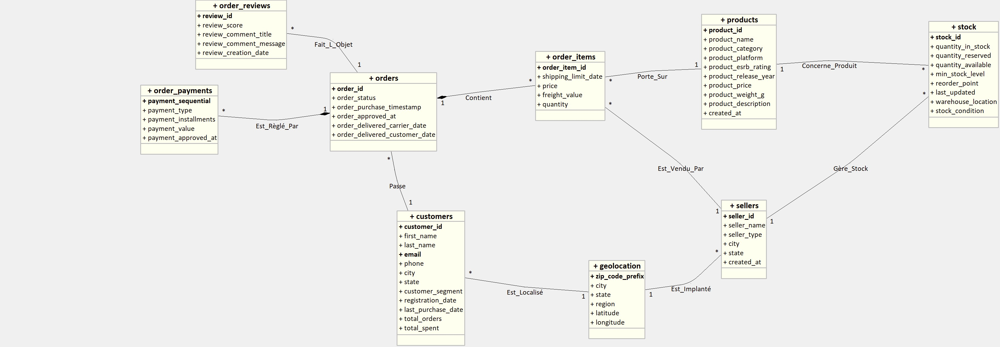

*Diagramme UML du système - Architecture complète du projet*

</div>

### Caracteristiques Principales

**Catalogue complet**
- 60 titres couvrant les principales plateformes (PS5, Xbox Series X/S, Nintendo Switch, PC)
- Métadonnées détaillées : catégories, classifications ESRB, année de sortie, descriptions

**Expérience client intégrée**
- Navigation avancée avec filtres multi-critères
- Panier persistant en session
- Processus de commande et paiement
- Système d'avis et de notation (1-5 étoiles)
- Tableau de bord client personnalisé

**Gestion administrative complète**
- CRUD complet pour produits, clients, commandes
- Gestion des stocks avec seuils d'alerte
- Segmentation automatique des clients
- Suivi des commandes en temps réel
- Tableau de bord analytique

**Sécurité et robustesse**
- Authentification sécurisée (mot de passe hashé)
- Validation des données à tous les niveaux
- Récupération de mot de passe par token
- Protection XSS et CSRF
- Gestion des erreurs et intégrité référentielle

### Architecture et Stack

L'application repose sur une architecture **MVC classique** :

- **Modèle (`magasin.py`)** : Logique métier et accès aux données avec Pandas
- **Vue (`templates/`)** : 16 templates Jinja2 responsifs
- **Contrôleur (`app.py`)** : Routeur Flask avec gestion des sessions

**Stack technologique :** Python 3.10+ • Flask 3.0 • MySQL 8.x • Pandas 2.0+ • Werkzeug • Gunicorn

Le projet est entièrement rédigé en **français** (interface, commentaires, nomenclature).

---

## Dernieres avancees

Les évolutions récentes du projet portent sur la **robustesse fonctionnelle** et la **qualité opérationnelle** :

### Sécurité et Authentification

**Récupération de mot de passe sécurisée**
- Routes `/forgot-password` et `/reset-password/<token>`
- Tokens avec expiration à 24h
- Hachage sécurisé avec Werkzeug (scrypt)

### Communication et Support Client

**Canal de contact intégré**
- Formulaire public `/contact`
- Envoi email SMTP automatique
- Échappement des contenus saisis (protection XSS)
- Notifications à l'administrateur

### Gestion Client et Segmentation

**Segmentation client automatisée**
- Recalcul automatique de `total_orders`, `total_spent`, `last_purchase_date`
- Attribution de segment client (`standard`, `silver`, `gold`, `platinum`)
- Mise à jour déclenchée après création de commande ou changement de statut

### Validation des Adresses

**Validation géographique renforcée**
- Contrôles centralisés ville / département / code postal
- Autocomplétion via API JSON `/api/geolocation`
- Validation appliquée à l'inscription et modification de profil
- Base de données locale de géolocalisation (zip_code, city, state)

### Intégrité des Données

**Gestion des comptes plus sûre**
- Suppression client avec traitement explicite des dépendances
- Restauration automatique du stock lors d'annulation de commande
- Respect de l'intégrité référentielle (contraintes MySQL)
- Audit des modifications (via statut et timestamps)

---

## Demarrage rapide

### Requirements

- **Python** 3.10+
- **MySQL** 8.x
- **pip** (gestionnaire de paquets)

### Installation rapide (5 minutes)

```bash
# 1. Cloner le depot
git clone https://github.com/AxelBcr/AppDec_VideoGame.git
cd AppDec_VideoGame

# 2. Installer les dependances
pip install -r requirements.txt

# 3. Configurer la base de donnees (creer fichier logs.py a la racine)
# host = "localhost"
# port = 3306
# user = "votre_utilisateur"
# password = "votre_mot_de_passe"
# database = "magasin_jeux_video"

# 4. Initialiser le schema MySQL
mysql -u votre_utilisateur -p magasin_jeux_video < docs/magasin_jeux_video.sql

# 5. Lancer l'application
python app.py
```

L'application sera accessible sur **`http://localhost:5000`**

Pour la configuration détaillée, voir [Installation et configuration](#installation-et-configuration).

---

## Fonctionnalites

### Espace Client

L'application offre une **expérience client complète et intuitive** pour naviguer, acheter et suivre les jeux vidéo.

#### Inscription et Authentification

L'inscription est sécurisée et validée à tous les niveaux. Les utilisateurs créent un compte avec email unique, téléphone au format français, et géolocalisation automatique du code postal. L'authentification utilise un mot de passe hashé avec Werkzeug (scrypt), garantissant la sécurité des données.

<div align="center">


*Formulaire d'inscription avec validation automatique et géolocalisation*

</div>

#### Catalogue et Navigation

Le catalogue présente **60 titres** avec des filtres avancés (nom, catégorie, plateforme, classification ESRB, prix). Chaque produit affiche des informations détaillées : description, année de sortie, plateforme disponible, classification d'âge, et prix.

<div align="center">

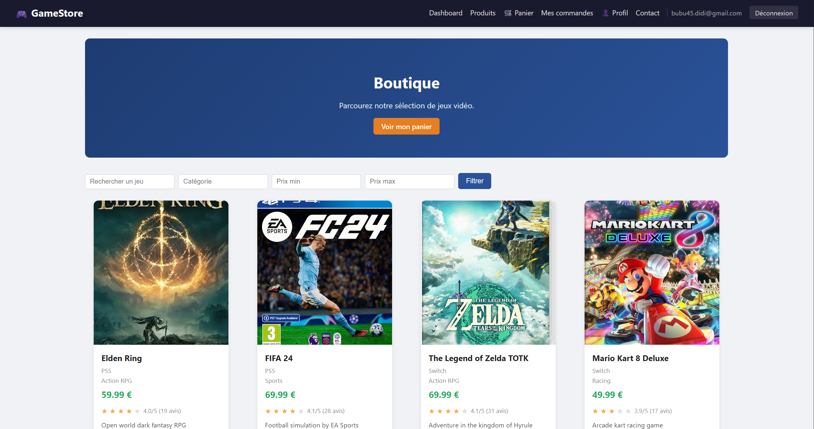

*Catalogue avec filtres avancés et navigation intuitive*

</div>

<div align="center">

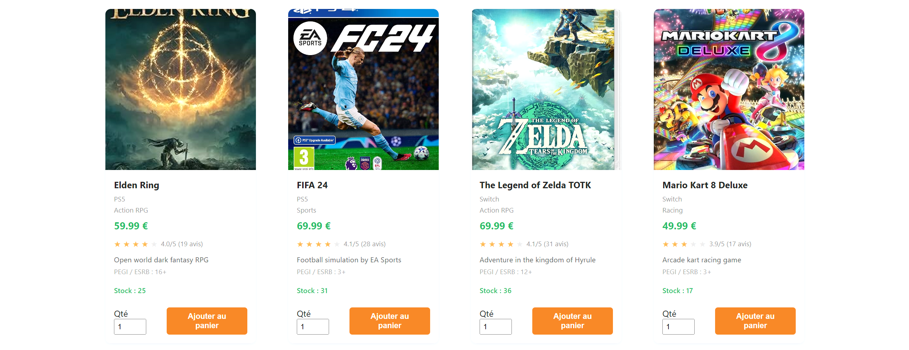

*Fiche produit détaillée avec description et métadonnées*

</div>

#### Panier et Commande

Le panier permet d'ajouter, retirer, et modifier les quantités. Il est **persistant en session**, l'utilisateur ne perd donc pas sa sélection en cas de déconnexion. Au checkout, le système met à jour automatiquement les stocks et crée une commande avec tous les détails.

<div align="center">

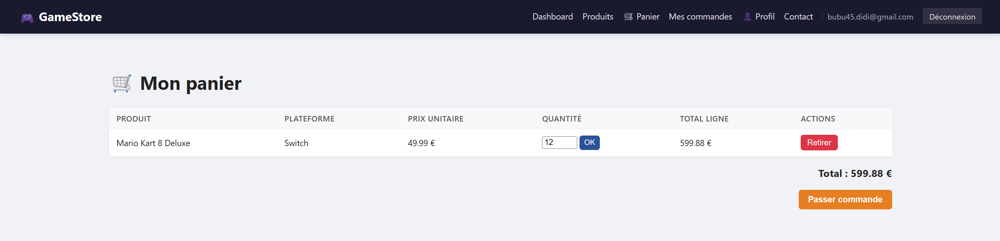

*Panier d'achat avec calcul automatique du total et gestion des quantités*

</div>

#### Suivi des Commandes

Après l'achat, les clients peuvent consulter l'historique complet de leurs commandes. Chaque commande affiche le statut (pending, processing, shipped, delivered, cancelled), la date, les articles, et le total payé. Les clients peuvent également annuler une commande en attente, ce qui restaure automatiquement le stock.

<div align="center">

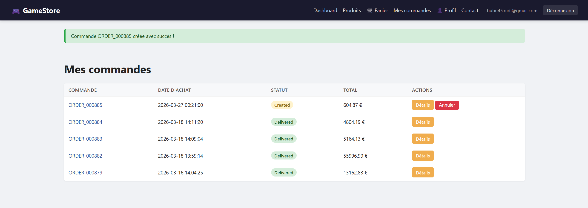

*Historique des commandes avec statuts et détails complets*

</div>

#### Système d'Avis et Notation

Les clients peuvent laisser un avis (1-5 étoiles) après réception d'une commande, avec titre et commentaire. Chaque client peut laisser un avis par commande, et le modifier ou le supprimer ultérieurement.

<div align="center">

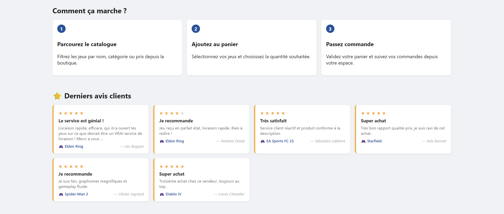

*Système d'avis avec notation par étoiles et commentaires*

</div>

#### Accueil et Tableau de Bord Client

L'accueil client affiche un résumé des informations clés et un accès rapide aux fonctionnalités principales. Le tableau de bord personnalisé affiche les commandes récentes, l'historique d'achats, les avis laissés, et les statistiques personnelles.

<div align="center">

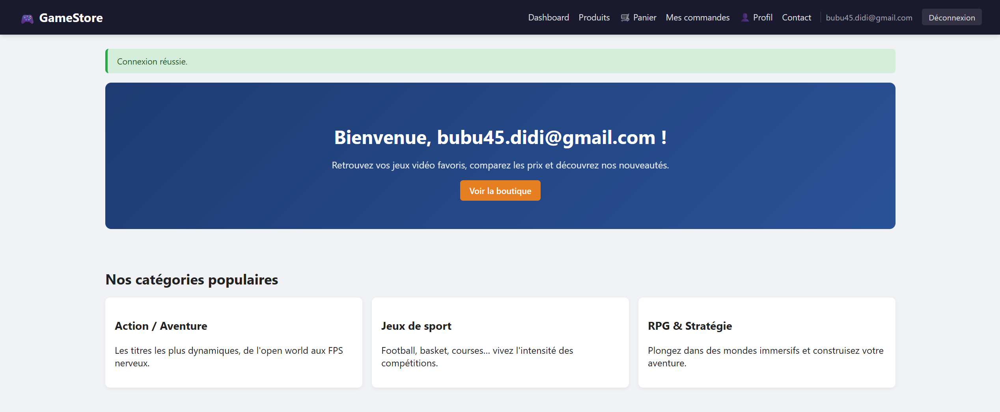

*Interface d'accueil client avec vue d'ensemble des activités*

</div>

<div align="center">


*Tableau de bord client avec accès rapide aux fonctionnalités*

</div>

### Espace Administrateur

Les administrateurs disposent d'une **suite complète de gestion** pour piloter l'application.

#### Tableau de Bord Administrateur

Le tableau de bord affiche les **statistiques clés en temps réel** : chiffre d'affaires du jour/mois, nombre de commandes, clients actifs, niveau de stock critique.

<div align="center">

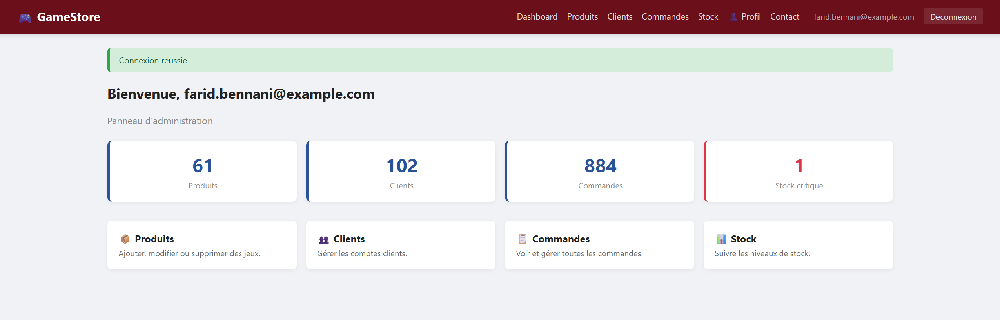

*Tableau de bord administrateur avec KPIs et statistiques en direct*

</div>

#### Gestion du Catalogue

Les administrateurs peuvent ajouter, modifier, ou supprimer des produits. Pour chaque jeu, ils configurent : nom, catégorie, plateforme, classification ESRB, prix, poids, description, et image.

<div align="center">

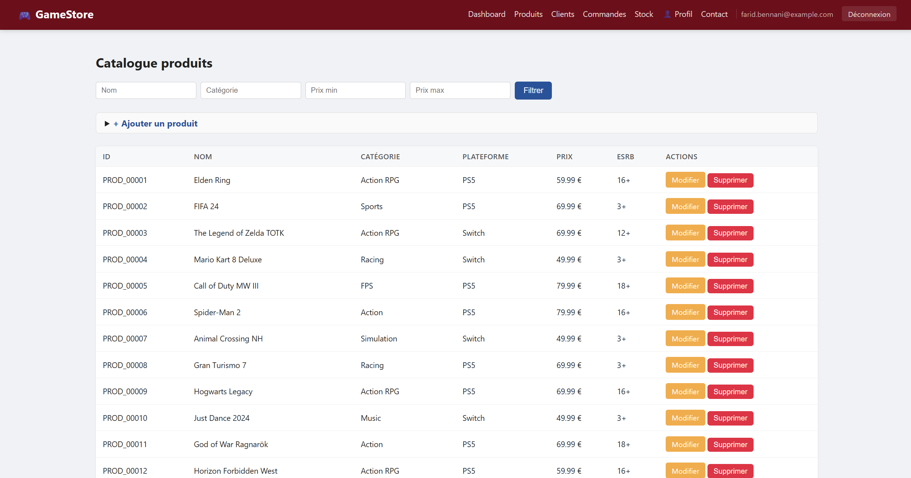

*Interface CRUD pour la gestion des produits du catalogue*

</div>

#### Gestion des Clients

La liste complète des clients est accessible avec tous leurs détails : contact, adresse, historique d'achats, segmentation. La **segmentation automatique** se fait selon les achats.

<div align="center">

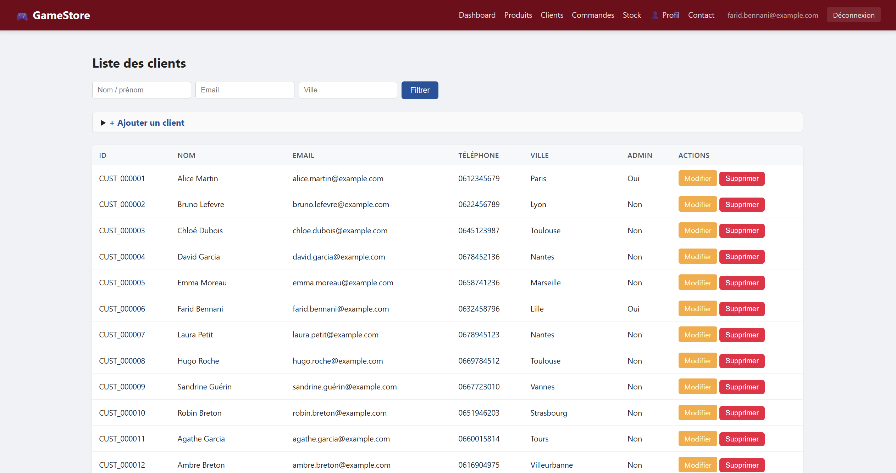

*Liste des clients avec segmentation automatique basée sur les achats*

</div>

#### Gestion des Commandes

Les administrateurs voient **toutes les commandes** de tous les clients, peuvent filtrer par statut ou client, et mettre à jour le statut (pending → processing → shipped → delivered).

<div align="center">

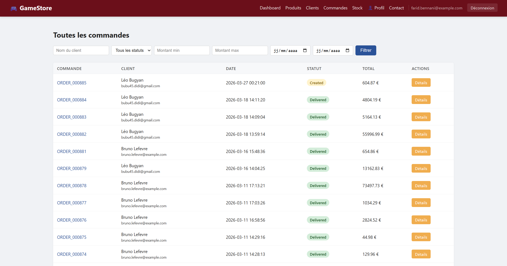

*Interface de gestion des commandes avec filtrage et mise à jour de statut*

</div>

#### Gestion des Stocks

La vue des stocks affiche par **vendeur et par produit** les quantités en stock, réservées, et disponibles. Des **seuils d'alerte** sont configurables pour éviter les ruptures.

<div align="center">

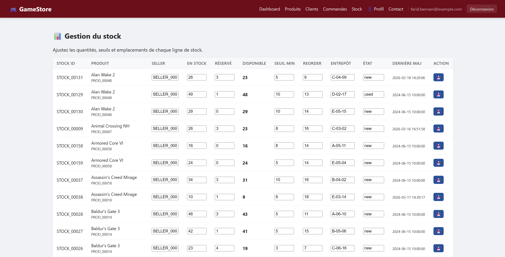

*Vue d'ensemble des stocks avec seuils d'alerte par vendeur*

</div>

### Support Client et Communication

Une **section dédiée au support** permet aux clients de contacter directement l'administrateur. Le formulaire valide les données et envoie un email SMTP automatiquement.

<div align="center">

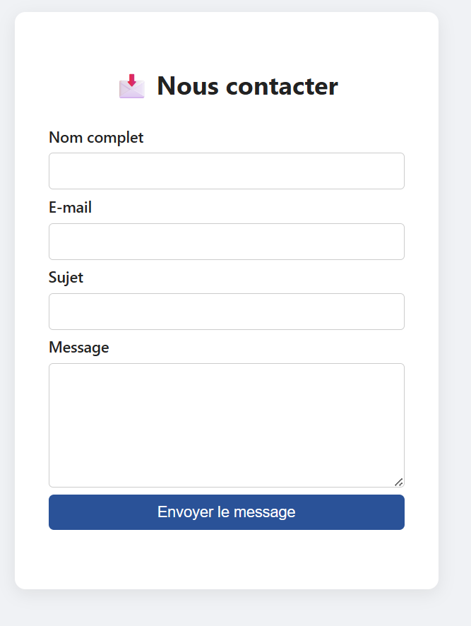

*Formulaire de contact sécurisé et validé*

</div>

---

## Architecture technique

### Stack technologique

| Couche | Technologie | Version | Rôle |
|---|---|---|---|
| **Langage** | Python | 3.10+ | Logique applicative et métier |
| **Framework web** | Flask | 3.0+ | Routage HTTP, sessions, templates Jinja2 |
| **Base de données** | MySQL | 8.x | Persistance des données relationnelles |
| **Connecteur BDD** | mysql-connector-python | 8.0+ | Communication avec MySQL |
| **Traitement données** | Pandas | 2.0+ | Manipulation des données en DataFrames |
| **Hachage sécurisé** | Werkzeug | 3.0+ | `generate_password_hash`, `check_password_hash` (scrypt) |
| **Serveur WSGI** | Gunicorn | 21.2+ | Déploiement en production |
| **Frontend** | HTML5 / CSS3 / JavaScript vanilla | -- | Interface utilisateur |

### Architecture en couches (MVC)

```
┌─────────────────────────────────────────────────────────┐
│                    Utilisateur                          │
│              Navigateur Web                             │
└──────────────────────┬──────────────────────────────────┘
                       │ HTTP/HTTPS
┌──────────────────────▼──────────────────────────────────┐
│   VUE - Templates Jinja2 (16 fichiers HTML)             │
│   app.py - Routes Flask (Contrôleur)                    │
│   Authentification, Sessions, Rendu de templates        │
└──────────────────────┬──────────────────────────────────┘
                       │ Appels de méthodes
┌──────────────────────▼──────────────────────────────────┐
│   MODELE - magasin.py (Logique métier)                  │
│   Classe Magasin : DataFrames Pandas + Validation       │
│   Authentification, Produits, Commandes, Stocks, etc.   │
└──────────────────────┬──────────────────────────────────┘
                       │ mysql-connector-python
┌──────────────────────▼──────────────────────────────────┐
│   BASE DE DONNEES - MySQL 8.x                           │
│   9 tables : customers, products, orders, etc.          │
│   Données de test : 100+ clients, 60 jeux, 350+ cdes    │
└─────────────────────────────────────────────────────────┘
```

### Base de Données

La structure de la base de données est optimisée pour les performances et la sécurité. Elle comprend **9 tables relationnelles** organisées logiquement.

<div align="center">

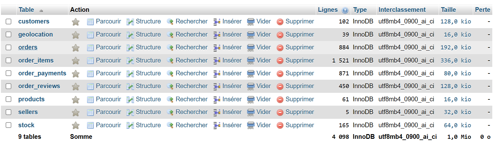

*Structure complète de la base de données avec relations entre tables*

</div>

L'accès à la base de données se fait via une connexion OVH sécurisée :

<div align="center">


*Configuration de l'accès sécurisé à la base de données*

</div>

### Composants principaux

| Fichier | Rôle | Lignes |
|---|---|---|
| **app.py** | Routeur Flask, contrôleur, gestion des requêtes | ~1500+ |
| **magasin.py** | Logique métier, accès aux données, validation | ~2000+ |
| **config.py** | Configuration Flask, sécurité, paramètres | ~50 |
| **templates/** | 16 templates Jinja2 responsifs | ~5000 total |
| **static/css/style.css** | Feuille de style principale | ~500 |
| **static/images/** | 60+ images des jeux vidéo | -- |
| **docs/** | Documentation, schéma SQL, diagrammes UML | -- |

---

## Structure du projet

```
AppDec_VideoGame/
│
├── Code Principal
│   ├── app.py                      # Application Flask (routes, contrôleurs)
│   ├── magasin.py                  # Couche métier et accès aux données
│   ├── config.py                   # Configuration Flask (clé secrète, cookies)
│   └── requirements.txt            # Dépendances Python (Flask, MySQL, Pandas, etc.)
│
├── Documentation
│   ├── README.md                   # Guide principal (ce fichier)
│   ├── CONTRIBUTING.md             # Guide de contribution
│   ├── CODE_OF_CONDUCT.md          # Code de conduite
│   ├── SECURITY.md                 # Politique de sécurité
│   ├── CHANGELOG.md                # Historique des versions
│   ├── LICENSE                     # Licence MIT
│   ├── QUICK_START.md              # Démarrage en 5 minutes
│   └── FILES_CREATED.md            # Documentation des fichiers
│
├── Configuration
│   ├── .env.example                # Template variables d'environnement
│   ├── .gitignore                  # Fichiers exclus du dépôt
│   └── .github/
│       ├── pull_request_template.md   # Template pour PR
│       ├── ISSUE_TEMPLATE.md          # Templates pour issues
│       └── workflows/
│           └── python-app.yml        # GitHub Actions (CI/CD)
│
├── Frontend
│   └── templates/                  # Templates Jinja2
│       ├── base.html               # Template de base (navigation, footer)
│       ├── login.html              # Page de connexion
│       ├── register.html           # Page d'inscription
│       ├── dashboard.html          # Tableau de bord administrateur
│       ├── dashboard_client.html   # Tableau de bord client
│       ├── profile.html            # Édition du profil utilisateur
│       ├── products.html           # Liste des produits (admin)
│       ├── products_store.html     # Boutique (client)
│       ├── edit_product.html       # Édition d'un produit (admin)
│       ├── customers.html          # Liste des clients (admin)
│       ├── edit_customer.html      # Édition d'un client (admin)
│       ├── cart.html               # Panier d'achat
│       ├── orders.html             # Commandes du client
│       ├── orders_admin.html       # Commandes (admin)
│       ├── order_detail.html       # Détail d'une commande et avis
│       ├── contact.html            # Formulaire de contact
│       ├── forgot_password.html    # Récupération mot de passe
│       └── reset_password.html     # Réinitialisation mot de passe
│
├── static/
│   ├── css/
│   │   └── style.css               # Feuille de style principale (responsive)
│   └── images/                     # Images des 60 jeux du catalogue
│
├── Images/                         # Captures d'écran (documentation)
│   ├── UML.jpg                     # Diagramme de classes UML
│   ├── BDD.png                     # Schéma de la base de données
│   ├── Activité_Ajout_Produits.png # Diagramme d'activité
│   ├── Diagramme connexion.png     # Diagramme de flux de connexion
│   ├── Diagramme création de compte.png
│   ├── Diagramme commande.png
│   └── [Captures d'écran de l'interface]
│
└── docs/
    ├── magasin_jeux_video.sql          # Schéma SQL complet + données
    ├── README_populate.txt             # Instructions de peuplement BD
    ├── Cahier des charges.pdf          # Cahier des charges du projet
    ├── cahier_analyse_specifications.docx
    └── diagrammes/
        ├── UML.jpg                     # Diagramme de classes UML
        ├── UML.loo                     # Source du diagramme
        ├── UML_magasin.txt             # Schéma UML en texte
        ├── Activité_Ajout_Produits.png # Diagramme d'activité
        ├── Activité_Ajout_Produits.mdj # Source du diagramme
        └── LoopingImage.jpg            # Diagramme relationnel
```

### Dépendances du Projet

**Python** 3.10+
```python
flask>=3.0                      # Framework web
mysql-connector-python>=8.0     # Connecteur MySQL
pandas>=2.0                     # Manipulation de données
werkzeug>=3.0                   # Hachage sécurisé
gunicorn>=21.2.0               # Serveur WSGI production
```

**Système** :
- MySQL 8.x (serveur de base de données)
- Git (contrôle de version)
- Bash/PowerShell (terminal)

---

## Modele de donnees

### Structure générale

L'application repose sur une architecture de **9 tables relationnelles** MySQL interconnectées et normalisées (3FN).

**Points clés :**
- Normalisation 3FN complète
- Contraintes d'intégrité référentielle (FK)
- Indexes sur clés primaires et étrangères
- Données de test : 100+ clients, 60 jeux, 350+ commandes
- Timestamps pour audit et traçabilité

Le schéma SQL complet est disponible dans **`docs/magasin_jeux_video.sql`**

### Schéma relationnel

```
              ┌─────────────────────┐
              │   geolocation       │
              │  (zip_code, city)   │
              └──────────┬──────────┘
                         │ (zip_code)
              ┌──────────▼──────────┐         ┌──────────────────┐
              │    customers        │◄────────┤   reviews        │
              │ (customer_id, zip)  │         │ (FK: customer_id)│
              └──────────┬──────────┘         └──────────────────┘
                         │
                    (customer_id)
                         │
              ┌──────────▼──────────┐         ┌──────────────────┐
              │     orders          │────────►│  order_items     │
              │  (order_id, status) │         │ (order_id, prod) │
              └──────────┬──────────┘         └──────────────────┘
                         │
              ┌──────────▼──────────┐
              │  order_payments     │
              │ (FK: order_id)      │
              └─────────────────────┘

              ┌─────────────────────┐         ┌──────────────────┐
              │    sellers          │────────►│     stock        │
              │  (seller_id, zip)   │         │ (FK: product_id) │
              └─────────────────────┘         └──────────────────┘

              ┌─────────────────────┐
              │     products        │
              │  (product_id)       │
              └─────────────────────┘
```

### Description des tables

<details>
<summary><strong>geolocation</strong> — Referentiel geographique (38 villes françaises)</summary>

| Colonne | Type | Description |
|---|---|---|
| `zip_code_prefix` | `INT` | Code postal (cle primaire) |
| `city` | `VARCHAR(100)` | Nom de la ville |
| `state` | `VARCHAR(50)` | Departement |
| `region` | `VARCHAR(100)` | Region administrative |
| `latitude` | `DECIMAL(10,7)` | Coordonnee GPS |
| `longitude` | `DECIMAL(10,7)` | Coordonnee GPS |

</details>

<details>
<summary><strong>customers</strong> — Clients (100 enregistrements)</summary>

| Colonne | Type | Description |
|---|---|---|
| `customer_id` | `VARCHAR(50)` | Identifiant unique (CUST_XXXXX) |
| `first_name` | `VARCHAR(100)` | Prenom |
| `last_name` | `VARCHAR(100)` | Nom |
| `email` | `VARCHAR(255)` | Adresse email (unique) |
| `password_hash` | `VARCHAR(255)` | Mot de passe hache (Werkzeug `generate_password_hash`) |
| `is_admin` | `TINYINT(1)` | Role administrateur (0 ou 1) |
| `phone` | `VARCHAR(20)` | Telephone (format FR) |
| `zip_code_prefix` | `INT` | Code postal (FK geolocation) |
| `city` | `VARCHAR(100)` | Ville |
| `state` | `VARCHAR(50)` | Departement |
| `address_line1` | `VARCHAR(255)` | Adresse ligne 1 |
| `address_line2` | `VARCHAR(255)` | Adresse ligne 2 |
| `customer_segment` | `VARCHAR(50)` | Segment (nouveau, casual, regular, premium, vip) |
| `registration_date` | `DATETIME` | Date d'inscription |
| `last_purchase_date` | `DATETIME` | Dernier achat |
| `total_orders` | `INT` | Nombre total de commandes |
| `total_spent` | `DECIMAL(10,2)` | Montant total depense |

</details>

<details>
<summary><strong>products</strong> — Catalogue de jeux video (60 titres)</summary>

| Colonne | Type | Description |
|---|---|---|
| `product_id` | `VARCHAR(50)` | Identifiant unique (PROD_XXXXX) |
| `product_name` | `VARCHAR(255)` | Nom du jeu |
| `product_category` | `VARCHAR(100)` | Categorie (Action RPG, Sports, Aventure...) |
| `product_platform` | `VARCHAR(50)` | Plateforme (PS5, Xbox, Switch, PC, Multi) |
| `product_esrb_rating` | `VARCHAR(20)` | Classification d'age (3+, 7+, 12+, 16+, 18+) |
| `product_release_year` | `INT` | Annee de sortie |
| `product_price` | `DECIMAL(10,2)` | Prix en euros |
| `product_weight_g` | `INT` | Poids en grammes |
| `product_description` | `TEXT` | Description du jeu |
| `product_image` | `TEXT` | Chemin vers l'image |
| `created_at` | `DATETIME` | Date de creation |

</details>

<details>
<summary><strong>sellers</strong> — Vendeurs et points de vente</summary>

| Colonne | Type | Description |
|---|---|---|
| `seller_id` | `VARCHAR(50)` | Identifiant unique (SELLER_XXXX) |
| `seller_name` | `VARCHAR(255)` | Nom du vendeur |
| `seller_type` | `VARCHAR(50)` | Type (Store, Warehouse, Distributor) |
| `zip_code_prefix` | `INT` | Code postal (FK geolocation) |
| `city` | `VARCHAR(100)` | Ville |
| `state` | `VARCHAR(50)` | Departement |
| `created_at` | `DATETIME` | Date de creation |

</details>

<details>
<summary><strong>orders</strong> — Commandes (350+ enregistrements)</summary>

| Colonne | Type | Description |
|---|---|---|
| `order_id` | `VARCHAR(50)` | Identifiant unique (ORDER_XXXXXX) |
| `customer_id` | `VARCHAR(50)` | Client (FK customers) |
| `order_status` | `VARCHAR(50)` | Statut de la commande |
| `order_purchase_timestamp` | `DATETIME` | Date de creation |
| `order_approved_at` | `DATETIME` | Date d'approbation |
| `order_delivered_carrier_date` | `DATETIME` | Date de remise au transporteur |
| `order_delivered_customer_date` | `DATETIME` | Date de livraison |

**Cycle de vie d'une commande :**

```
pending ──► processing ──► shipped ──► delivered
               │
               └──► cancelled
```

</details>

<details>
<summary><strong>order_items</strong> — Lignes de commande</summary>

| Colonne | Type | Description |
|---|---|---|
| `order_id` | `VARCHAR(50)` | Commande (FK orders, CASCADE) |
| `order_item_id` | `INT` | Numero de ligne |
| `product_id` | `VARCHAR(50)` | Produit (FK products) |
| `seller_id` | `VARCHAR(50)` | Vendeur (FK sellers) |
| `price` | `DECIMAL(10,2)` | Prix unitaire au moment de l'achat |
| `freight_value` | `DECIMAL(10,2)` | Frais de livraison |
| `quantity` | `INT` | Quantite commandee |
| `shipping_limit_date` | `DATETIME` | Date limite d'expedition |

Cle primaire composite : `(order_id, order_item_id)`

</details>

<details>
<summary><strong>order_payments</strong> — Paiements</summary>

| Colonne | Type | Description |
|---|---|---|
| `order_id` | `VARCHAR(50)` | Commande (FK orders, CASCADE) |
| `payment_sequential` | `INT` | Numero sequentiel du paiement |
| `payment_type` | `VARCHAR(50)` | Type (credit_card, paypal, etc.) |
| `payment_installments` | `INT` | Nombre d'echeances |
| `payment_value` | `DECIMAL(10,2)` | Montant du paiement |
| `payment_approved_at` | `DATETIME` | Date d'approbation |

Cle primaire composite : `(order_id, payment_sequential)`

</details>

<details>
<summary><strong>order_reviews</strong> — Avis clients</summary>

| Colonne | Type | Description |
|---|---|---|
| `review_id` | `VARCHAR(50)` | Identifiant unique (REVIEW_XXXXX) |
| `order_id` | `VARCHAR(50)` | Commande (FK orders, CASCADE) |
| `review_score` | `INT` | Note de 1 a 5 |
| `review_comment_title` | `VARCHAR(255)` | Titre de l'avis |
| `review_comment_message` | `TEXT` | Contenu de l'avis |
| `review_creation_date` | `DATETIME` | Date de creation |

</details>

<details>
<summary><strong>stock</strong> — Gestion des stocks</summary>

| Colonne | Type | Description |
|---|---|---|
| `stock_id` | `VARCHAR(50)` | Identifiant unique (STOCK_XXXXX) |
| `product_id` | `VARCHAR(50)` | Produit (FK products) |
| `seller_id` | `VARCHAR(50)` | Vendeur (FK sellers) |
| `quantity_in_stock` | `INT` | Quantite totale en stock |
| `quantity_reserved` | `INT` | Quantite reservee (commandes en cours) |
| `quantity_available` | `INT` | Quantite disponible a la vente |
| `min_stock_level` | `INT` | Seuil minimum d'alerte (defaut : 12) |
| `reorder_point` | `INT` | Point de reapprovisionnement (defaut : 19) |
| `last_updated` | `DATETIME` | Derniere mise a jour |
| `warehouse_location` | `VARCHAR(50)` | Emplacement en entrepot |
| `stock_condition` | `VARCHAR(50)` | Etat (new, used, refurbished) |

Contrainte d'unicite : `(seller_id, product_id)`

</details>

---

## Routes et API

### Pages web

<table>
<thead>
<tr>
<th>Methode</th>
<th>Route</th>
<th>Acces</th>
<th>Description</th>
</tr>
</thead>
<tbody>
<tr><td colspan="4"><strong>Authentification</strong></td></tr>
<tr>
<td><code>GET</code> <code>POST</code></td>
<td><code>/login</code></td>
<td>Public</td>
<td>Connexion utilisateur</td>
</tr>
<tr>
<td><code>GET</code> <code>POST</code></td>
<td><code>/register</code></td>
<td>Public</td>
<td>Inscription d'un nouveau client</td>
</tr>
<tr>
<td><code>GET</code> <code>POST</code></td>
<td><code>/forgot-password</code></td>
<td>Public</td>
<td>Demande de reinitialisation de mot de passe</td>
</tr>
<tr>
<td><code>GET</code> <code>POST</code></td>
<td><code>/reset-password/&lt;token&gt;</code></td>
<td>Public</td>
<td>Reinitialisation du mot de passe avec token temporaire</td>
</tr>
<tr>
<td><code>GET</code> <code>POST</code></td>
<td><code>/contact</code></td>
<td>Public</td>
<td>Formulaire de contact avec envoi email</td>
</tr>
<tr>
<td><code>GET</code></td>
<td><code>/logout</code></td>
<td>Connecte</td>
<td>Deconnexion et suppression de session</td>
</tr>
<tr><td colspan="4"><strong>Tableaux de bord</strong></td></tr>
<tr>
<td><code>GET</code></td>
<td><code>/</code></td>
<td>Connecte</td>
<td>Redirection vers le tableau de bord</td>
</tr>
<tr>
<td><code>GET</code></td>
<td><code>/dashboard</code></td>
<td>Connecte</td>
<td>Tableau de bord (admin ou client selon le role)</td>
</tr>
<tr><td colspan="4"><strong>Profil</strong></td></tr>
<tr>
<td><code>GET</code> <code>POST</code></td>
<td><code>/profile</code></td>
<td>Connecte</td>
<td>Consultation et modification du profil</td>
</tr>
<tr><td colspan="4"><strong>Produits</strong></td></tr>
<tr>
<td><code>GET</code></td>
<td><code>/products</code></td>
<td>Admin</td>
<td>Liste des produits (administration)</td>
</tr>
<tr>
<td><code>POST</code></td>
<td><code>/products/add</code></td>
<td>Admin</td>
<td>Ajout d'un produit</td>
</tr>
<tr>
<td><code>GET</code> <code>POST</code></td>
<td><code>/products/edit/&lt;id&gt;</code></td>
<td>Admin</td>
<td>Modification d'un produit</td>
</tr>
<tr>
<td><code>POST</code></td>
<td><code>/products/delete/&lt;id&gt;</code></td>
<td>Admin</td>
<td>Suppression d'un produit</td>
</tr>
<tr>
<td><code>GET</code></td>
<td><code>/products_store</code></td>
<td>Client</td>
<td>Boutique avec filtres et catalogue</td>
</tr>
<tr><td colspan="4"><strong>Clients</strong></td></tr>
<tr>
<td><code>GET</code></td>
<td><code>/customers</code></td>
<td>Admin</td>
<td>Liste des clients</td>
</tr>
<tr>
<td><code>POST</code></td>
<td><code>/customers/add</code></td>
<td>Admin</td>
<td>Ajout d'un client</td>
</tr>
<tr>
<td><code>GET</code> <code>POST</code></td>
<td><code>/customers/edit/&lt;id&gt;</code></td>
<td>Admin</td>
<td>Modification d'un client</td>
</tr>
<tr>
<td><code>POST</code></td>
<td><code>/customers/delete/&lt;id&gt;</code></td>
<td>Admin</td>
<td>Suppression d'un client</td>
</tr>
<tr><td colspan="4"><strong>Panier</strong></td></tr>
<tr>
<td><code>GET</code></td>
<td><code>/cart</code></td>
<td>Client</td>
<td>Affichage du panier</td>
</tr>
<tr>
<td><code>POST</code></td>
<td><code>/cart/add/&lt;id&gt;</code></td>
<td>Client</td>
<td>Ajout d'un article au panier</td>
</tr>
<tr>
<td><code>POST</code></td>
<td><code>/cart/remove/&lt;id&gt;</code></td>
<td>Client</td>
<td>Retrait d'un article du panier</td>
</tr>
<tr>
<td><code>POST</code></td>
<td><code>/cart/update</code></td>
<td>Client</td>
<td>Mise a jour des quantites</td>
</tr>
<tr>
<td><code>POST</code></td>
<td><code>/cart/checkout</code></td>
<td>Client</td>
<td>Validation et creation de la commande</td>
</tr>
<tr><td colspan="4"><strong>Commandes</strong></td></tr>
<tr>
<td><code>GET</code></td>
<td><code>/orders</code></td>
<td>Connecte</td>
<td>Liste des commandes (admin : toutes ; client : les siennes)</td>
</tr>
<tr>
<td><code>GET</code></td>
<td><code>/orders/&lt;id&gt;</code></td>
<td>Connecte</td>
<td>Detail d'une commande</td>
</tr>
<tr>
<td><code>POST</code></td>
<td><code>/orders/&lt;id&gt;/status</code></td>
<td>Admin</td>
<td>Mise a jour du statut</td>
</tr>
<tr>
<td><code>POST</code></td>
<td><code>/orders/&lt;id&gt;/cancel</code></td>
<td>Connecte</td>
<td>Annulation de commande (restauration du stock)</td>
</tr>
<tr><td colspan="4"><strong>Avis</strong></td></tr>
<tr>
<td><code>POST</code></td>
<td><code>/reviews/add/&lt;order_id&gt;</code></td>
<td>Client</td>
<td>Ajout d'un avis sur une commande</td>
</tr>
<tr>
<td><code>POST</code></td>
<td><code>/reviews/edit/&lt;review_id&gt;</code></td>
<td>Client</td>
<td>Modification d'un avis</td>
</tr>
<tr>
<td><code>POST</code></td>
<td><code>/reviews/delete/&lt;review_id&gt;</code></td>
<td>Client</td>
<td>Suppression d'un avis</td>
</tr>
<tr><td colspan="4"><strong>Stock</strong></td></tr>
<tr>
<td><code>GET</code></td>
<td><code>/stock</code></td>
<td>Admin</td>
<td>Vue d'ensemble des stocks</td>
</tr>
<tr>
<td><code>POST</code></td>
<td><code>/stock/update/&lt;id&gt;</code></td>
<td>Admin</td>
<td>Mise a jour des quantites</td>
</tr>
</tbody>
</table>

### API JSON (autocompletion)

Ces endpoints fournissent des données JSON pour l'autocomplétion des formulaires d'adresse.

<table>
<thead>
<tr>
<th>Methode</th>
<th>Route</th>
<th>Description</th>
</tr>
</thead>
<tbody>
<tr>
<td><code>GET</code></td>
<td><code>/api/cities</code></td>
<td>Liste des villes disponibles</td>
</tr>
<tr>
<td><code>GET</code></td>
<td><code>/api/states</code></td>
<td>Liste des departements</td>
</tr>
<tr>
<td><code>GET</code></td>
<td><code>/api/zip_codes</code></td>
<td>Liste des codes postaux</td>
</tr>
<tr>
<td><code>GET</code></td>
<td><code>/api/geolocation</code></td>
<td>Recherche croisee ville / departement / code postal</td>
</tr>
<tr>
<td><code>GET</code></td>
<td><code>/api/categories</code></td>
<td>Categories de produits</td>
</tr>
<tr>
<td><code>GET</code></td>
<td><code>/api/platforms</code></td>
<td>Plateformes de jeu</td>
</tr>
</tbody>
</table>

---

## Couche metier

La classe `Magasin` dans `magasin.py` encapsule toute la logique métier et l'accès aux données. Elle utilise des **DataFrames Pandas** comme couche intermédiaire pour la manipulation des données.

### Principaux modules

<details>
<summary><strong>Authentification et utilisateurs</strong></summary>

| Methode | Description |
|---|---|
| `magasin_login(email, password)` | Verification des identifiants avec `check_password_hash` |
| `check_is_admin(email)` | Verification du role administrateur |
| `register_customer(...)` | Inscription avec generation d'identifiant et validation |
| `add_customer(...)` | Ajout d'un client par l'administrateur |
| `update_profile(customer_id, ...)` | Mise a jour du profil par le client |
| `modify_customer(customer_id, ...)` | Modification d'un client par l'administrateur |
| `del_customer(customer_id)` | Suppression d'un client |

</details>

<details>
<summary><strong>Gestion des produits</strong></summary>

| Methode | Description |
|---|---|
| `add_product(name, category, ...)` | Ajout d'un jeu au catalogue |
| `modify_products(product_id, ...)` | Modification des informations d'un produit |
| `del_product(product_id)` | Suppression d'un produit |
| `filter_products_id(df, product_id)` | Filtrage par identifiant |
| `filter_products_name(df, name)` | Recherche par nom (partielle) |
| `filter_products_price(df, min, max)` | Filtrage par fourchette de prix |
| `filter_products_category(df, category)` | Filtrage par categorie |

</details>

<details>
<summary><strong>Commandes et panier</strong></summary>

| Methode | Description |
|---|---|
| `create_order_from_cart(customer_id, cart)` | Creation d'une commande a partir du panier avec mise a jour du stock |
| `get_all_orders()` | Recuperation de toutes les commandes |
| `get_customer_orders(customer_id)` | Commandes d'un client specifique |
| `get_order_details(order_id)` | Detail complet d'une commande (items, paiements) |
| `update_order_status(order_id, status)` | Changement de statut avec mise a jour des statistiques client |
| `filter_orders(df, status, customer_name)` | Filtrage des commandes |

</details>

<details>
<summary><strong>Stocks</strong></summary>

| Methode | Description |
|---|---|
| `get_stock_view()` | Vue globale des niveaux de stock |
| `update_stock(stock_id, ...)` | Modification des quantites |
| `_restore_stock_for_order(cursor, order_id)` | Restauration du stock lors d'une annulation |

</details>

<details>
<summary><strong>Avis clients</strong></summary>

| Methode | Description |
|---|---|
| `add_review(order_id, score, title, message)` | Creation d'un avis |
| `update_review(review_id, ...)` | Modification d'un avis existant |
| `delete_review(review_id)` | Suppression d'un avis |
| `get_review_for_order(order_id)` | Avis associe a une commande |
| `get_reviews_for_product(product_id)` | Tous les avis d'un produit |
| `get_product_avg_score(product_id)` | Note moyenne d'un produit |
| `get_recent_reviews(limit)` | Derniers avis publies |

</details>

<details>
<summary><strong>Validation des donnees</strong></summary>

| Methode | Description |
|---|---|
| `_check_non_empty_string(value)` | Chaine non vide |
| `_check_positive_number(value)` | Nombre strictement positif |
| `_check_email(value)` | Format email valide |
| `_check_phone_fr(value)` | Telephone au format francais (0X XX XX XX XX) |
| `_check_zip_code_fr(value)` | Code postal francais (5 chiffres) |
| `_check_year(value)` | Annee valide |
| `validate_geolocation(zip, city, state)` | Validation croisee code postal / ville / departement |

</details>

---

## Templates et interface

L'interface utilise **16 templates Jinja2** avec un système d'héritage basé sur `base.html`. Le design est responsive et s'adapte au rôle de l'utilisateur (client ou administrateur).

### Hierarchie des templates

```
base.html
├── login.html
├── register.html
├── dashboard.html              (admin)
├── dashboard_client.html       (client)
├── profile.html
├── products.html               (admin)
├── products_store.html         (client)
├── edit_product.html           (admin)
├── customers.html              (admin)
├── edit_customer.html          (admin)
├── cart.html                   (client)
├── orders.html                 (client)
├── orders_admin.html           (admin)
├── order_detail.html
└── stock.html                  (admin)
```

### Charte graphique

<table>
<thead>
<tr>
<th>Code couleur</th>
<th>Nom</th>
<th>Utilisation</th>
</tr>
</thead>
<tbody>
<tr>
<td><code>#1a1a2e</code></td>
<td>Bleu nuit</td>
<td>En-tete et navigation (mode client)</td>
</tr>
<tr>
<td><code>#6b0f1a</code></td>
<td>Rouge sombre</td>
<td>En-tete et navigation (mode admin)</td>
</tr>
<tr>
<td><code>#f0f2f5</code></td>
<td>Gris clair</td>
<td>Arriere-plan du corps de page</td>
</tr>
<tr>
<td><code>#2a5298</code></td>
<td>Bleu</td>
<td>Boutons et liens principaux</td>
</tr>
</tbody>
</table>

---

## Installation et configuration

### Pre-requis

Avant de commencer, assurez-vous de disposer de :

- **Python** 3.10 ou supérieur (vérifiez avec `python --version`)
- **MySQL** 8.x (en local ou distant)
- **pip** (gestionnaire de paquets Python)
- **Git** pour cloner le dépôt

> Pour Windows, téléchargez depuis [python.org](https://www.python.org/) et [mysql.com](https://www.mysql.com/)

### Installation étape par étape

#### Étape 1 — Cloner le dépôt

```bash
git clone https://github.com/AxelBcr/AppDec_VideoGame.git
cd AppDec_VideoGame
```

#### Étape 2 — Créer un environnement virtuel (recommandé)

```bash
# Sur Windows
python -m venv venv
venv\Scripts\activate

# Sur macOS/Linux
python3 -m venv venv
source venv/bin/activate
```

#### Étape 3 — Installer les dépendances

```bash
pip install -r requirements.txt
```

**Dépendances principales :**

| Paquet | Version | Rôle |
|---|---|---|
| `flask` | 3.0+ | Framework web MVC |
| `mysql-connector-python` | 8.0+ | Connecteur MySQL |
| `pandas` | 2.0+ | Manipulation et analyse de données |
| `werkzeug` | 3.0+ | WSGI utilities et hachage de mots de passe |
| `gunicorn` | 21.2+ | Serveur WSGI pour production |

#### Étape 4 — Configurer la base de données

Créer un fichier **`logs.py`** à la racine du projet :

```python
# logs.py - Configuration MySQL
host = "localhost"          # ou votre adresse serveur
port = 3306
user = "votre_utilisateur"  # ex: root
password = "votre_mot_de_passe"
database = "magasin_jeux_video"
```

> **Important :** Ce fichier est ignoré par Git (`.gitignore`). Ne pas le committer.

Créer ensuite la base de données :

```bash
mysql -u votre_utilisateur -p
```

```sql
CREATE DATABASE magasin_jeux_video CHARACTER SET utf8mb4 COLLATE utf8mb4_unicode_ci;
USE magasin_jeux_video;
```

#### Étape 5 — Importer le schéma et les données

```bash
mysql -u votre_utilisateur -p magasin_jeux_video < docs/magasin_jeux_video.sql
```

Ce script crée **9 tables** et insère les données de démonstration :
- 100 clients de test
- 60 jeux vidéo complets
- 350+ commandes avec historique
- Stocks, vendeurs, paiements et avis

#### Étape 6 — (Optionnel) Configurer les e-mails

Pour activer les fonctionnalités d'email (réinitialisation de mot de passe, contact, email de bienvenue), créer `MailAPI.txt` à la racine :

```ini
# Configuration SMTP (exemple avec Mailtrap)
MAILTRAP_SMTP_HOST=live.smtp.mailtrap.io
MAILTRAP_SMTP_PORT=587
MAILTRAP_SMTP_USERNAME=api
MAILTRAP_SMTP_PASSWORD=votre_token_mailtrap

# Données de l'expéditeur
MAILTRAP_FROM_NAME=AppDec VideoGame Store
MAILTRAP_FROM_EMAIL=noreply@magasin-jeux.com
```

> Créez un compte gratuit sur [Mailtrap](https://mailtrap.io) pour les tests.

#### Étape 7 — Lancer l'application

**Mode développement :**

```bash
python app.py
```

Accédez à **`http://localhost:5000`**

**Mode production :**

```bash
gunicorn app:app --bind 0.0.0.0:8000 --workers 4
```

### Configuration avancée

#### Variables d'environnement

```bash
# Windows (PowerShell)
$env:FLASK_SECRET_KEY = "votre_cle_secrete_ici"
$env:FLASK_ENV = "development"

# macOS/Linux
export FLASK_SECRET_KEY="votre_cle_secrete_ici"
export FLASK_ENV="development"
```

#### Paramètres Flask (config.py)

| Paramètre | Valeur par défaut | Production |
|---|---|---|
| `SECRET_KEY` | Aléatoire | Personnalisée |
| `SESSION_COOKIE_HTTPONLY` | `True` | Garder `True` |
| `SESSION_COOKIE_SAMESITE` | `Lax` | Passer à `Strict` |
| `SESSION_COOKIE_SECURE` | `False` | Passer à `True` (HTTPS requis) |
| `DEBUG` | `True` | **Toujours** `False` en production |

### Dépannage

| Problème | Solution |
|---|---|
| `ModuleNotFoundError: No module named 'flask'` | Exécuter `pip install -r requirements.txt` et vérifier l'environnement virtuel |
| `Access denied for user 'root'@'localhost'` | Vérifier `logs.py` : nom d'utilisateur et mot de passe MySQL |
| `Can't connect to MySQL server` | Vérifier que MySQL est démarré (`net start MySQL80` sur Windows) |
| `RuntimeError: The session cookie domain must be a string` | Passer `SESSION_COOKIE_SAMESITE` à `Lax` ou `Strict` dans `config.py` |
| Emails non envoyés | Vérifier `MailAPI.txt` et les paramètres SMTP |

---

## Utilisation

### Comptes de démonstration

L'import SQL initial inclut des comptes de test préconfigurés. Consultez `docs/README_populate.txt` pour les identifiants de test inclus dans le dump SQL.

### Parcours client typique

#### Étape 1 — Inscription

Un client commence par créer un compte via `/register`. Il renseigne ses coordonnées : email, mot de passe, nom, téléphone (format français), et adresse. Le système valide chaque champ et lui envoie un email de confirmation.

<div align="center">


*Processus complet d'inscription avec validation et confirmation*

</div>

#### Étape 2 — Connexion

Après inscription, le client se connecte via `/login` avec email et mot de passe. Le système vérifie les identifiants hashés et crée une session sécurisée.

<div align="center">


*Interface de connexion avec authentification sécurisée*

</div>

<div align="center">


*Flux d'authentification sécurisé avec session persistante*

</div>

#### Étapes 3 à 8 — Navigation et achat

Le client parcourt le catalogue avec filtres (3), ajoute des jeux au panier (4), consulte et modifie son panier (5), valide la commande (6), suit ses commandes (7), et laisse un avis (8).

<div align="center">


*Cycle complet de la commande : du panier à la livraison et avis*

</div>

| Étape | Action | Route |
|---|---|---|
| 1 | Créer un compte | `/register` |
| 2 | Se connecter | `/login` |
| 3 | Parcourir le catalogue | `/products_store` |
| 4 | Ajouter des jeux au panier | `/cart/add/<id>` |
| 5 | Consulter le panier | `/cart` |
| 6 | Valider la commande | `/cart/checkout` |
| 7 | Suivre la commande | `/orders/<id>` |
| 8 | Laisser un avis | `/reviews/add/<order_id>` |

### Parcours administrateur typique

L'administrateur accède au panneau d'administration pour gérer tous les aspects de la boutique depuis un **tableau de bord centralisé**.

| Étape | Action | Route |
|---|---|---|
| 1 | Se connecter (compte admin) | `/login` |
| 2 | Consulter le tableau de bord | `/dashboard` |
| 3 | Gérer le catalogue | `/products` |
| 4 | Gérer les clients | `/customers` |
| 5 | Traiter les commandes | `/orders` |
| 6 | Surveiller les stocks | `/stock` |

#### Processus d'ajout de produit

<div align="center">


*Diagramme d'activité du processus d'ajout de produits*

</div>

Ce processus inclut la validation des métadonnées, l'upload de l'image, la configuration des stocks initiaux, l'assignation aux vendeurs, et la vérification avant publication.

---

## Securite

### Mesures de sécurité implémentées

| Mesure | Implémentation | Niveau |
|---|---|---|
| **Hachage des mots de passe** | Werkzeug `generate_password_hash` / `check_password_hash` (scrypt) | Excellent |
| **Protection XSS** | Cookies HTTPOnly + Échappement automatique Jinja2 | Excellent |
| **Protection CSRF** | Cookies `SameSite=Lax` | Bon |
| **Contrôle d'accès** | Vérification du rôle (admin/client) sur chaque route protégée | Excellent |
| **Credentials** | Fichier `logs.py` exclu du dépôt Git (`.gitignore`) | Excellent |
| **Clé secrète** | Générée aléatoirement ou via variable d'environnement | Bon |
| **Validation des entrées** | Contrôles sur email, téléphone (FR), code postal, prix, quantités | Excellent |
| **Intégrité référentielle** | Suppression contrôlée des dépendances (commandes → client) | Excellent |
| **Tokens expirables** | Réinitialisation de mot de passe avec token (expiration 24h) | Bon |

---

## Support et contact

### Obtenir de l'aide

- **Signaler un bug** : [Ouvrir une issue GitHub](https://github.com/AxelBcr/AppDec_VideoGame/issues/new?template=bug_report.md)
- **Proposer une fonctionnalité** : [Discussions GitHub](https://github.com/AxelBcr/AppDec_VideoGame/discussions)
- **Contact direct** : Formulaire `/contact` dans l'application
- **Questions générales** : [Ouvrir une discussion](https://github.com/AxelBcr/AppDec_VideoGame/discussions)

---

## Documentation complementaire

Les documents suivants sont disponibles dans le repertoire `docs/` :

| Document | Description |
|---|---|
| `magasin_jeux_video.sql` | Schéma SQL complet avec données de test |
| `README_populate.txt` | Instructions de peuplement de la base |
| `Cahier des charges.pdf` | Cahier des charges du projet |
| `cahier_analyse_specifications.docx` | Analyse et spécifications détaillées |
| `diagrammes/UML.jpg` | Diagramme de classes UML |
| `diagrammes/Activité_Ajout_Produits.png` | Diagramme d'activité (ajout de produits) |
| `diagrammes/LoopingImage.jpg` | Modèle relationnel (Looping) |
| `diagrammes/UML_magasin.txt` | Schéma UML en format texte |

---

## License

Ce projet est distribué sous la licence **MIT**. Voir le fichier [LICENSE](LICENSE) pour plus de détails.

**Résumé :** Vous êtes libre d'utiliser, modifier et distribuer ce code à usage commercial ou non-commercial, à condition d'inclure une copie de la licence et une notice de non-responsabilité.

```
MIT License

Copyright (c) 2024 Développement d'applications décisionnelles - Bachelor Data Science

Permission is hereby granted, free of charge, to any person obtaining a copy
of this software and associated documentation files (the "Software"), to deal
in the Software without restriction, including without limitation the rights
to use, copy, modify, merge, publish, distribute, sublicense, and/or sell
copies of the Software, and to permit persons to whom the Software is
furnished to do so, subject to the following conditions:

The above copyright notice and this permission notice shall be included in all
copies or substantial portions of the Software.
```

---

<div align="center">

[](https://github.com/AxelBcr/AppDec_VideoGame)
[](https://github.com/AxelBcr/AppDec_VideoGame/fork)
[](https://github.com/AxelBcr/AppDec_VideoGame/issues)

*Version 1.0.0 — Python · Flask · MySQL · Pandas*

</div>
